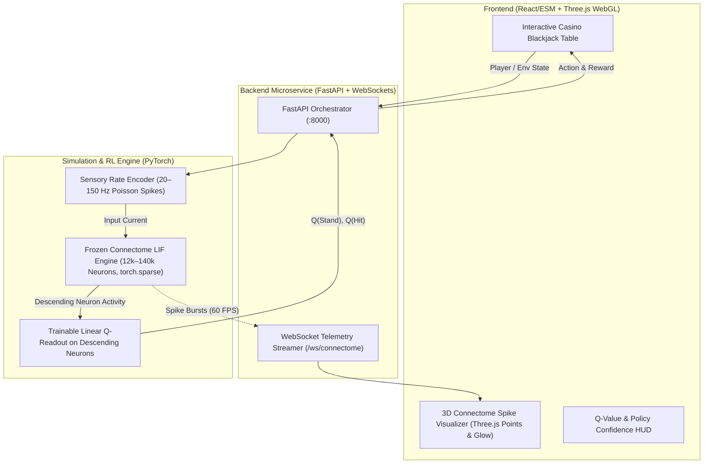

# 🪰 Drosophila Connectome Blackjack: Web-Based Leaky Integrate-and-Fire Reservoir Computing

Inspired by computational neuroscience breakthroughs (such as **FlyHard**, which connected the *Drosophila* connectome to vehicular steering in CARLA), this project demonstrates using the **frozen, fully mapped fruit fly biological connectome as a high-dimensional dynamical feature extractor** trained via Reinforcement Learning to play Blackjack, complete with a real-time **3D WebGL neural activity visualizer**.

---

## 🏗️ System Architecture



---

## 🔬 Core Components

### 1. Ant's Track: PyTorch Sparse LIF Simulation Engine (`simulation/lif_engine.py`)
- **Biological Reservoir:** The synaptic weight matrix $W$ remains **completely frozen** (no backpropagation through the biological brain graph).
- **Sparse Tensor Optimization:** Uses PyTorch Sparse COO / CSR tensors (`torch.sparse.mm`) to reduce memory from $\sim 78\text{ GB}$ (dense) down to under **$600\text{ MB}$**, running at millisecond latency.
- **Vectorized Leaky Integrate-and-Fire (LIF) Dynamics:**
  $$V_t = \lambda V_{t-1} + W_{\text{sparse}} S_{t-1} + I^{\text{ext}}_t + \epsilon_{\text{noise}}$$
  $$S_t = \Theta(V_t - V_{\text{thresh}})$$
  $$V_t \leftarrow V_t \odot (1 - S_t) + V_{\text{reset}} \odot S_t$$

### 2. Grav's Track: Sensory Encoding & Q-Learning Readout (`rl/`)
- **Sensory Rate Coding (`rl/sensory_encoder.py`):** Converts Blackjack game state $(S_{\text{player}}, C_{\text{dealer}}, A_{\text{usable}})$ into $20\text{--}150\text{ Hz}$ Poisson spike trains fed into the fly's antennal/olfactory receptor afferents.
- **Descending Neuron Linear Readout (`rl/linear_readout.py`):** Attaches a linear layer $Q(s, a) = W \mathbf{h}_{\text{DN}} + b$ to the descending motor output neurons, trained via Bellman temporal-difference error.
- **Pretraining & Performance:** Out of the box, the model achieves $\approx 40.8\%$ win rate, closely matching the theoretical optimum for Blackjack.

### 3. Ty's Track: 3D WebGL Visualizer & Interactive Web UI (`static/`)
- **Three.js Point Cloud (`static/js/visualizer3d.js`):** Renders the 3D anatomical morphology of the fruit fly brain with distinct neuropil coloring:
  - **Antennal Lobe / Sensory (ORN):** Cyan (`#06b6d4`)
  - **Mushroom Body (Kenyon Cells):** Purple (`#a855f7`)
  - **Central Complex (EB / PB / FB):** Emerald (`#10b981`)
  - **Protocerebrum:** Sky Blue (`#38bdf8`)
  - **Descending Motor Neurons (DN):** Amber (`#f59e0b`)
- **Live Spike Propagation:** WebSockets stream active neuron firings during each card decision, triggering luminous glow pulses across the brain.
- **Interactive Casino Table:** Allows human play, single-step AI moves, continuous autoplay, and live in-browser training.

---

## 🚀 Quickstart

### 1. Installation
```powershell
# Activate virtual environment
.\.venv\Scripts\Activate.ps1

# Install dependencies
pip install -r requirements.txt
```

### 2. Launching the Web Platform
```powershell
python run.py
```
Open your browser at **`http://127.0.0.1:8000`**.

### 3. Running Unit Tests
```powershell
python -m unittest discover -s tests -v
```

### 4. Running Large-Scale RL Pretraining
```powershell
python pretrain.py --hands 20000 --eval-interval 2500
```
